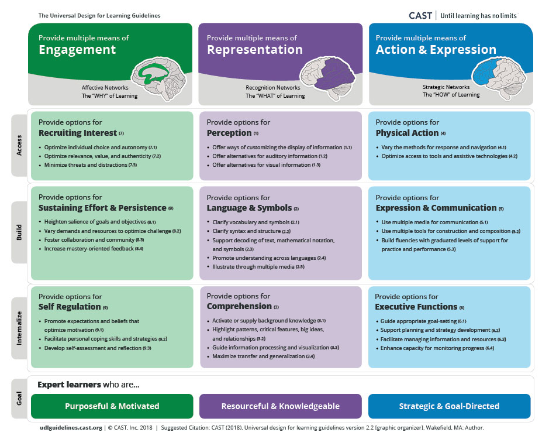

**See main points of Conference Talk**

[*https://docs.google.com/document/d/1VkCHWVu-Qoc7ShY7YomfaN9IZTaXrk7h0E-s8VDcjp8/edit\#*](https://docs.google.com/document/d/1VkCHWVu-Qoc7ShY7YomfaN9IZTaXrk7h0E-s8VDcjp8/edit#)

For more detailed overview - See local doc

Draft in progress.

[*https://docs.google.com/document/d/181896Hoo0Odp2JlbqL92MrYzRs280gPtXJnWfj8t2ZQ/edit\#*](https://docs.google.com/document/d/181896Hoo0Odp2JlbqL92MrYzRs280gPtXJnWfj8t2ZQ/edit#)

[]{#anchor}Titles

-   []{#anchor-1}Alternative Learning Dimensions to Computational     Thinking -   Project-based approaches to Computing -   Handling the Hands On -   What are they learning? Diversities

As an overview from the beginning there was a large focus on CT in the computing curriculum. At the same time the elements of creativity were also rolled up in the process.

This chapter will look at different interpretations of Computational Thinking means from a critical perspective and looking at the different resources available to teachers.

A view on some of the strategies to address issues of participation [*quick read pedagogy approaches*](https://blog.teachcomputing.org/tag/pedagogy/) - the good and the bad.

I'll suggest that a more abstract approach to CT, while containing the promise of transfer to other domains, has the danger of distracting teachers from other creative ways of representing the learning outcomes of more hands on approaches.

I'll cover the potential of project based learning and how this can create inclusive educational approaches. We will also meet UDL universal design for learning as a framework.

Finally we look at the challenge for teachers balancing the requirements of the curriculum and doing hands-on work. What may change? After school projects - home work with parents - alternative provision. The question of equality then remains how can young people from a wide variety of backgrounds benefit from this approach. And do this at KS3.

**Sections**

**Context of UK - from perspective of learning dimensions pushed.\ **

-   The nature of content / skills that are valued in curriculum and     report - stem pipeline, transfer, problem solving -   Computational Thinking and transfer - challenge of that transfer - -   Report - After the Reboot Nature of CT as an abstract concept - and     issues of inclusion

**A Narrative of a Growing doubt**

Mark Guzdial, started keen on transfer, now a bigger doubt of transfer, and starting to redefine what CT should be about.

**Problematising CT**

-   Outliers - Wing - Brennan and Resnick -   Which is most unique to computing?

Papert - as teh originator, procedural thinking, but what is the nature of that procedure, is it abstract and suitable to transfer, or is it more of a tacit skill.

Papert wrote extensively of the value of the concrete.

At this point, say don't throw out the abstract, but don't lead with it -

Danger of leading with it - what's happened - teachers say what is CT, they find out in a decontextualised way - and then reproduce it .

**Other suitable Frameworks**

Are they more accessible / flexible

-   21C Skills (problem solving) -   Design Thinking -   Creative Spiral

We can compare creative spiral to Resnick's work on computational thinking - one is more transferable to all design projects - pot

**Recap / Meet in Middle**

CT is potentially useful but alternatives exist which may be more accessible.

In any case - DON'T LEAD with it.

**UDL and PBL**

Create a Table of the overlap of the PBL and the UDL

{width="3.2035in" height="3.3957in"}

{width="6.5in" height="5.278in"}

  ------------------------------------ ------------------------------------   **PBL**                              **UDL**   Authenticity - Real Life Relevance   Authenticity / Real Life Relevance   Public Project                          Critique and Revision                                                           ------------------------------------ ------------------------------------ 