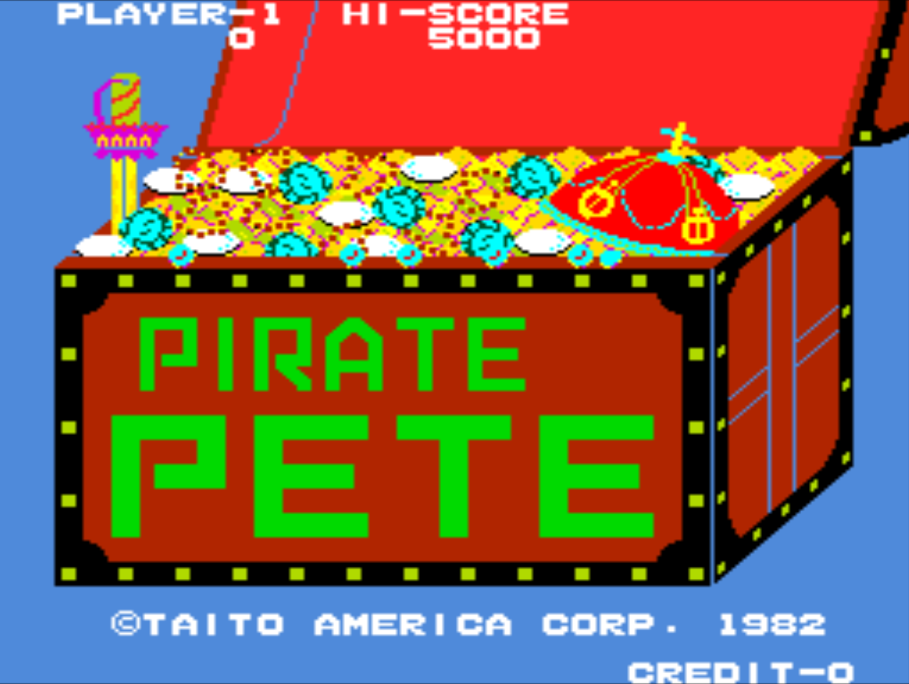

---
# all the regular stuff you have here
zotero:
  scannable-cite: false # only relevant when your compiling to scannable-cite .odt
  client: zotero # defaults to zotero
  author-in-text: false # when true, enabled fake author-name-only cites by replacing it with the text of the last names of the authors
  csl-style: harvard # pre-fill the style
...
# Overview of Family Learning
## Background and Introduction

The focus of this study is on collaborative production in family learning environments. I plan to approach it from constructivist, sociocultural perspectives. I am keen to involved, playful use of games and accessible construction materials to aid the creative process, lowering barriers to participation and help build confidence develop the identities of participant as makers and creators. The interaction between physical and digital aspects of the making processes is of great interest to me.

The term family learning is problematic in that it can encompass all learning happening in a home learning environment or on visits outside the home with family members or may refer to more formal provision. In this section I will use the term FL to indicate more formal provision.

{width="17cm" height="12.802cm"}

Interest in the home learning environment is growing as it is a recognised as an important factor in developmental paths of children [@tekinbas_quest_2010].

References
