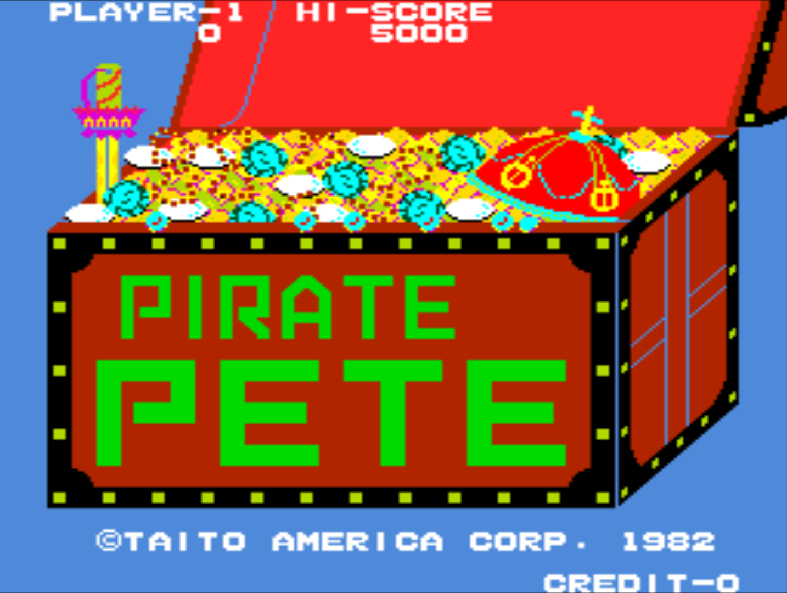

Overview of Family Learning  ============================

########## Background and Introduction 

The focus of this study is on collaborative production in family learning environments. I plan to approach it from constructivist, sociocultural perspectives. I am keen to involved, playful use of games and accessible construction materials to aid the creative process, lowering barriers to participation and help build confidence develop the identities of participant as makers and creators. The interaction between physical and digital aspects of the making processes is of great interest to me.

Family Learning Provision -------------------------

The term family learning is problematic in that it can encompass all learning happening in a home learning environment or on visits outside the home with family members or may refer to more formal provision. In this section I will use the term FL to indicate more formal provision.

{width="17cm" height="12.802cm"}

MOVE \_ Interest in the home learning environment is growing as it is a recognised as an important factor in developmental paths of children Melhuish et al., 2008).

Family in this context is normally taken to mean one or more family members of which one is a child and other fulfilling a parental role, which could be a parent, grandparent, relative or sibling Lamb, 2009). Recent reviews adopt a similarly broad definition of FL to encompass streams of activities streams of activity are identified as Family Literacy, Language and Numeracy (FLLN) and Wider Family Learning (WFL), the former focusing on the relevant key skills and the latter following a broader curriculum including creative activities, music, and digital literacies Brooks et al., 2008; Carpentieri, 2012; Grant, 2009; Lamb, 2009; *Review of family learning*, 2016). Lamb 2009) notes that this categorisation may be seen as more administrative than pedagogical in nature, citing two relevant funding streams available in the UK from the Learning Skills Council. Potential outcomes and dimensions of family learning include "progression, self-confidence and self-esteem motivation and self-efficacy aspirations and ambitions parenting practices, human capital, social and cultural capital" Lamb, 2009)

Research on the impact of these programmes is limited Brooks et al., 2008; Lamb, 2009; Swain et al., 2014) and mostly focused on the academic attainment of children related to FLLN programmes. However, broad benefits include parents reporting more confidence in how to support their children's learning, indeed that was a greater motivation for parents than to improve their own skills Swain et al., 2014).

Play in a Family Learning Context ---------------------------------

Needham identifies parent toddler groups, or "stay and play sessions" in the UK as an under-researched area Needham, 2011, p. 91). He charts a short history of disparate playing together sessions with little governmental support before 1997 and a growth of supported sessions under New-Labour which develop into increasingly sophisticated pedagogical interventions which encouraged parents to engage and support with their child's play processes Anning et al., 2005).

An exploration of the terminology of play and games will be explored elsewhere in my writing. For the purposes of this section play is broadly considered to be is seen as activities which are voluntary, and playful in nature in that they are not serious, productive activities. I note a key distinction is between two key categories of play , epistemic / exploratory and ludic play which draws on fantasy and symbolic play with a greater focus on interaction between individuals Hutt, 1979). This distinction is important as it reflects a broader shift in the approach of early years literature towards a sociocultural approach to education.

While the EYFS frame work explicitly acknowledges the importance of 'sustained shared thinking' Sylva et al., 2004), there are still many refences to much more individual practices and learning designs the requirements of the EYFS framework and associated literature Needham, 2011). This focus can be attributed to the legacy of the influence on previous educational policies of a piagetian focus on cognitive progress through individual exploratory play Siraj-Blatchford, 2004).

Rogoff constest a view of Piaget as play solely focused on individual exploration, but acknowledges that that was how his work was interpreted and translated into policy Rogoff, 1991). The implication for support of young people in practice is that adults should take an active role in the facilitation of more social, ludic play forms rather than focusing only on facilitating access to learning environments and materials that priviledge on more individual exploratory play. Rogoff draws on the work of Vygotskian school of scholars to help define an approach of guided participation and shared thinking 1998)

Needham and Jackson 2014) draw our attention to the desirability for precise definitions in this domain of child adult helping strategies, citing attempts by Jordan to differentiate scaffolding and co-creation Jordan, 2004) and contrasting them with conceptions of shared thinking.

These points (on practice) are relevant to this exploration of the factors involving a broad view of family learning in two ways. Firstly a wider view of family learning as broadly intergenerational may mirror joint working between adults in a more formal setting and thus research findings are relevant. Secondly expectations of professionals of how adults can support children's learning may influence those of parents they come into contact with and may cause tensions in practice Needham, 2011).

A key line of research concerning the importance of the home learning environment (HLE) is the longitudinal study EPPE (Effective Provision of Pre-school Education) which gathered data of pre-school environment of young people and found that the a stimulating HLE to be the most significant factor in determining progression in cognitive, social and behavioural skills Evangelou et al., 2005; Feinstein et al., 2004).

\ 